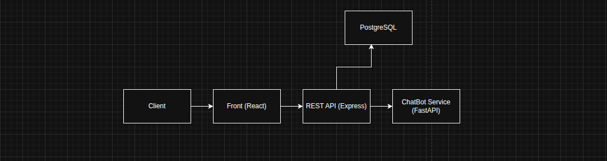

# Projeto Fernanda

Projeto de Chatbot sobre educação fiscal. A ideia do projeto é ensinar às pessoas sobre educação fiscal e espalhar conteúdo informativo sobre a fiscalização brasileira.

## Tecnologias

- **React** - Frontend
- **Node.js + Express** - API principal
- **FastAPI** - Serviço do ChatBot
- **Docker** - Conteinarização
- **Prisma** - ORM
- **PostgreSQL** - Banco de Dados

## Estrutura do Projeto
```
FernandaBot
    /Backend
        /Express
            /app
                /config
                /controllers
                /database
                /middlewares
                /models
                /routes
                /services
                app.js
                server.js
            Dockerfile
            start_express.sh
        /FastAPI
            /app
                /routes
                /schemas
                server.py
            Dockerfile
            requirements.txt
            start_chatbot.sh
    /Frontend
        /src
            /assets
            /components
            /pages
            /services
        App.jsx
        main.jsx
    /prisma
        schema.prisma
    .env-example
    .gitignore
    docker-compose.yml
    package-lock.json
    package.json
    README.md

```

## Como rodar o Projeto

**Passo 1** - Clonar repo
```
git clone <url do repositorio>
```

**Passo 2** - Criar .env na raiz do projeto
```
POSTGRES_USER=admin
POSTGRES_PASSWORD=12345
POSTGRES_DB=db
SECRET_KEY='sua_chave_secreta'
DATABASE_URL="postgresql://admin:12345@db:5432/db"
```
**Passo 3** - Rodar migrations
```
npx prisma migrate dev --name init
```

**Passo 4** - Comando docker para buildar
```
docker compose up -d --build
```

## Arquitetura

### Alto Nível


### Backend Express
- routes -> Recebe requisições
- controllers -> Trata requisições
- services -> Regras de negócio
- models -> Queries do banco
- database -> Conexão com o banco

### Backend FastAPI
- routes -> Lógica do ChatBot
- schemas -> Definição da entrada e saida de dados e suas tipagens

### Frontend
- assets -> imagens, logos, fontes..
- components -> componentes reutilizáveis
- pages -> páginas do sistema
- services -> chamadas de api

---